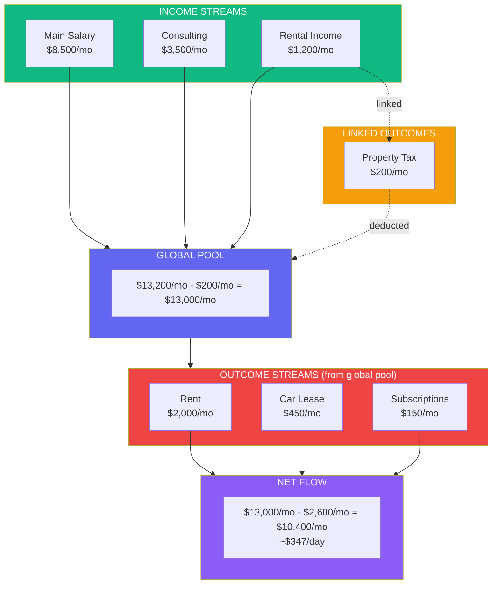

# FlowMetrics
> An income streams dashboard that answers: **Where am I? Where am I going? Where will I be?**


## The Problem

Personal finance applications are obsessed with expenses. Mint, YNAB, Monarch - they all focus on budgeting and expense categorization. Net worth apps like Kubera show static wealth, not income flows.

**There's no tool that answers:**
- How much am I generating per day from multiple sources?
- What's the trend?
- Where will I be in 6 months?

The visual pattern we need already exists - but in cloud billing tools like Azure Cost Explorer, AWS Billing, and GCP Cost Management. Only applied in reverse: not "how much I spend" but **"how much I generate"**.

## The Pain Point

Modern professionals increasingly have diversified income sources. Traders, content creators, freelancers, consultants, SaaS founders - they all face the same challenge: **no unified view of financial inflows**.

Each income source lives in its own silo:
- Exchange dashboards show trading PnL
- Bank statements show salary deposits
- Platform dashboards show creator earnings
- Spreadsheets (maybe) try to consolidate everything

The result? Simple questions become impossible to answer:
- What's the true daily income rate across all sources?
- Which streams are growing vs declining?
- How long until reaching financial goals?
- What happens if one stream disappears?

## Core Features

| Feature | Description |
|---------|-------------|
| **Multi-Source Aggregation** | Connect multiple income sources (exchanges, platforms, manual entries) |
| **Plugin-Based Connectors** | Extensible connector system for adding new integrations |
| **Real-Time Sync** | Background jobs sync data every 5 minutes with live Activity Log |
| **Daily Normalization** | Convert all income to daily rates for fair comparison |
| **Stacked Area Charts** | Azure Cost Explorer-style visualization of income streams |
| **Statistical Analysis** | Daily rate, trends, standard deviation, stream health |
| **Financial Projections** | 6-month projections with confidence scoring |
| **Seasonality Detection** | Day-of-week and month-of-year income patterns |
| **What-If Analysis** | Simulate impact of losing an income stream |
| **Stream Performance** | Ranking, contribution percentages, trend indicators |
| **Income Stability** | Fixed vs variable income ratio, concentration risk |
| **Live Dashboard** | Auto-refresh UI updates every 10 seconds |

### Supported Connectors

| Connector | Type | Description |
|-----------|------|-------------|
| **Blofin Exchange** | Syncable | Crypto exchange - syncs total balance in USD |
| **Recurring Income** | Recurring | Manual entry for salary, rent, subscriptions |

## Technical Stack

| Layer | Technology |
|-------|------------|
| **Frontend** | Blazor Server (.NET 10) + MudBlazor |
| **Charts** | ApexCharts.Blazor |
| **Database** | PostgreSQL |
| **ORM** | Entity Framework Core |
| **Background Jobs** | Native BackgroundService (IHostedService) |
| **Architecture** | Clean Architecture + Modular Monolith |
| **Results** | FluentResults for railway-oriented programming |

### Architecture

```
Income/src/
├── Connectors/                    # Plugin-based connector system
│   └── Connectors.Blofin/         # Blofin exchange connector
├── Host/
│   └── Dashboard/                 # Blazor Server UI
└── Modules/
    ├── Income/                    # Income streams, snapshots, providers
    │   ├── Income.Application/    # Services, interfaces, DTOs
    │   ├── Income.Domain/         # Entities, value objects
    │   ├── Income.Infrastructure/ # EF Core, jobs, services
    │   ├── Income.Contracts/      # Cross-module DTOs
    │   └── Income.Installer/      # DI registration
    └── Analytics/                 # Statistics and projections
        ├── Analytics.Application/
        └── Analytics.Infrastructure/
```

### Background Jobs

| Job | Interval | Purpose |
|-----|----------|---------|
| **SyncJob** | 5 min | Syncs data from API-based connectors (Blofin) |
| **RecurringJob** | 5 min | Generates snapshots for recurring income streams |
| **TestDataGeneratorJob** | 5 min | Generates random test data (dev only) |

### Modern C# Features (.NET 10)

- Primary constructors
- Collection expressions
- Required members
- File-scoped types
- Pattern matching
- Records for DTOs and Value Objects

## Phase 2 Vision: Outcome Streams

### The Missing Half

Phase 1 answers **"How much am I generating?"** - but financial clarity requires understanding both sides of the equation. Phase 2 introduces **Outcome Streams**: the mirror image of Income Streams, tracking where money flows out.

> **Important:** This is NOT budgeting. Traditional budgeting apps track individual transactions (groceries, coffee, subscriptions). FlowMetrics tracks **flows** - high-level recurring financial commitments that drain your income over time.

### The Azure Billing Analogy

Just as Azure Billing shows each resource consuming money per minute/day/month:

| Azure Resource | Cost Model |
|----------------|------------|
| Virtual Machine | $X per hour |
| Storage Account | $X per GB/month |
| App Service | $X per day |

FlowMetrics Outcome Streams work the same way:

| Outcome Stream | Cost Model |
|----------------|------------|
| Rent/Mortgage | $X per month |
| Car Lease | $X per month |
| Netflix | $X per month |
| Gym Membership | $X per month |
| Insurance | $X per year (normalized to daily) |

Every outcome has a **burn rate** - a cost per time unit that continuously drains from your income.

### Flow Connection

The key innovation is **linking Outcome Streams to Income Streams**:



**Two connection modes:**

1. **Linked to specific Income Stream** - Property Tax links to Rental Income because that outcome is directly tied to that income source
2. **Global Pool (default)** - General living expenses draw from the combined total of all income streams

### What Phase 2 Enables

| Question | Answer |
|----------|--------|
| What's my true daily net rate? | Income rate minus outcome rate |
| Which income stream is most "loaded"? | Streams with many linked outcomes |
| What if I lose a stream? | See both income loss AND freed outcomes |
| When will I reach $X saved? | Project based on net flow rate |
| What's my burn rate? | Total outcome streams normalized to daily |

### Outcome Stream Features (Planned)

| Feature | Description |
|---------|-------------|
| **Recurring Outcomes** | Fixed costs: rent, subscriptions, insurance |
| **Variable Outcomes** | Estimated averages: utilities, groceries |
| **Flow Linking** | Connect outcomes to specific income sources |
| **Burn Rate Analysis** | Daily/monthly outcome totals |
| **Net Flow Dashboard** | Income - Outcomes visualization |
| **Sustainability Score** | How long can current lifestyle sustain? |
| **What-If (Outcomes)** | Simulate adding/removing outcomes |

### Architecture Extension

```
Income/src/
├── Modules/
│   ├── Income/                    # Existing - money flowing IN
│   │   ├── Income.Application/
│   │   ├── Income.Domain/
│   │   ├── Income.Infrastructure/
│   │   └── Income.Contracts/
│   │
│   ├── Outcome/                   # NEW - money flowing OUT (mirrors Income)
│   │   ├── Outcome.Application/   # Services, interfaces, DTOs
│   │   ├── Outcome.Domain/        # OutcomeStream, BurnRate, FlowLink
│   │   ├── Outcome.Infrastructure/# EF Core, outcome tracking
│   │   └── Outcome.Contracts/     # Cross-module DTOs
│   │
│   └── Analytics/                 # Extended for net flow calculations
│       ├── Analytics.Application/ # NetFlowAnalytics service
│       └── Analytics.Infrastructure/
```

---

## Roadmap

### Phase 1: Foundation ✓
- [x] Project structure setup (Clean Architecture)
- [x] Database schema and EF Core configuration
- [x] Domain entities and value objects
- [x] Blazor Server UI with MudBlazor

### Phase 2: Income Streams ✓
- [x] Provider and stream management
- [x] Manual/recurring income entry
- [x] Plugin-based connector architecture
- [x] Blofin exchange integration
- [x] Real-time Activity Log
- [x] Auto-refresh dashboard
- [x] Stream enable/disable toggle
- [x] Notification system (sync success/failure)

### Phase 3: Analytics ✓
- [x] Statistical calculations (daily rate, trends)
- [x] Stream health analysis (growing/stable/declining)
- [x] 6-month projections with confidence scoring
- [x] Seasonality analysis (day-of-week, month-of-year patterns)
- [x] What-If analysis (stream removal impact simulation)
- [x] Stream performance ranking
- [x] Income stability metrics (fixed vs variable, concentration risk)
- [ ] Multi-currency support with live rates

### Phase 4: Outcome Streams (Next)
- [ ] Outcome module (mirror of Income module)
- [ ] OutcomeStream entity with burn rate
- [ ] Recurring outcomes (fixed costs)
- [ ] Variable outcomes (estimated averages)
- [ ] Flow linking (outcome → income stream)
- [ ] Global pool calculation
- [ ] Net flow dashboard
- [ ] Burn rate analytics

### Phase 5: Advanced Analytics
- [ ] Net flow projections (income - outcomes)
- [ ] Sustainability scoring
- [ ] What-If for outcomes
- [ ] Combined stacked charts (income vs outcome)
- [ ] Financial runway calculator

### Phase 6: Expansion
- [ ] Additional exchange connectors (Binance, Bybit, OKX)
- [ ] Bank integrations (Plaid)
- [ ] Monte Carlo simulation for probabilistic projections
- [ ] Email/webhook notifications for anomalies
- [ ] Mobile PWA support

## Getting Started

### Prerequisites
- .NET 10 SDK
- Docker & Docker Compose
- PostgreSQL (or use Docker)

### Running with Docker

```bash
cd Income
docker-compose up -d
```

Access the dashboard at `http://localhost:5000`

### Development

```bash
cd Income
dotnet restore
dotnet run --project src/Host/Dashboard
```

## Target Audience

- **Active traders** with multiple exchange accounts
- **Content creators** with Patreon/YouTube/Substack income
- **Freelancers** juggling multiple clients
- **Side hustlers** balancing employment with projects
- **SaaS founders** tracking MRR alongside consulting

## License

MIT License - See LICENSE file for details.

---

*Built with Blazor Server, .NET 10, MudBlazor, and Clean Architecture principles.*
